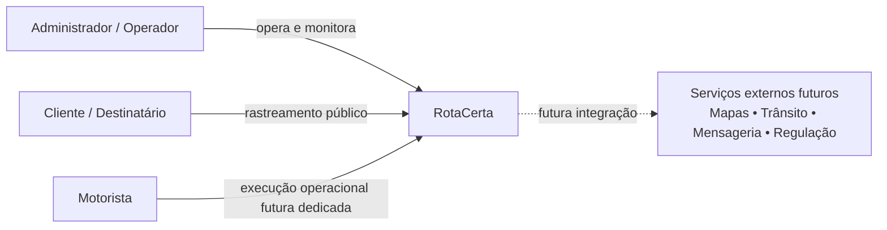
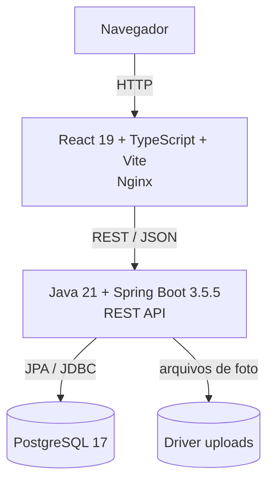
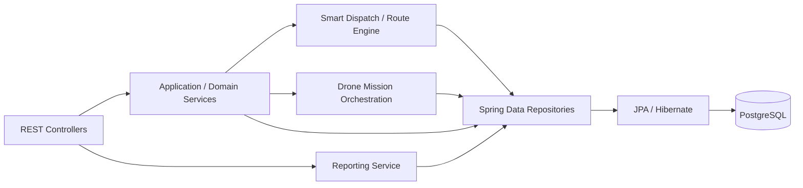
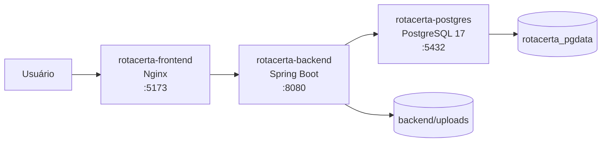
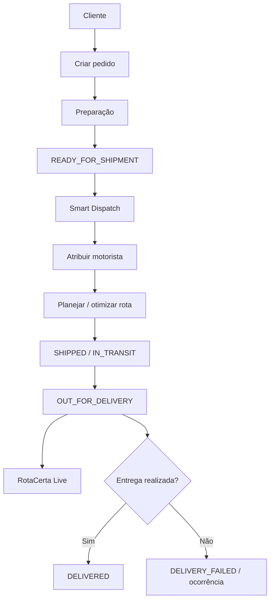
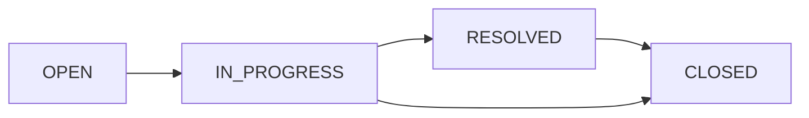
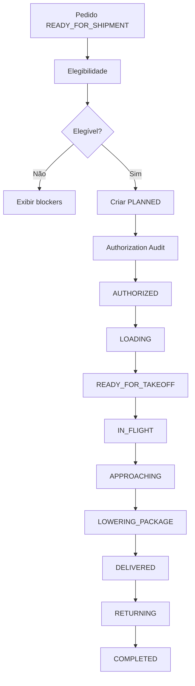
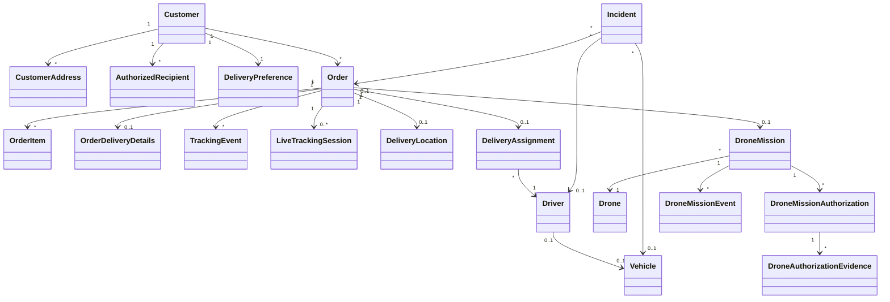
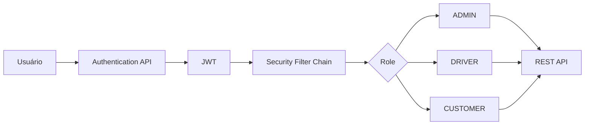

# RotaCerta — Arquitetura de Software e Especificação de Requisitos

> **Documento técnico oficial do projeto**  
> **Sistema:** RotaCerta — Smart E-commerce Logistics, Delivery & Drone Simulation Platform  
> **Versão do documento:** 1.0  
> **Referência de arquitetura:** branch `feat/operations-suite`  
> **Stack principal:** React + TypeScript • Java 21 + Spring Boot • PostgreSQL • Flyway • Docker Compose

---

## 1. Objetivo do documento

Este documento descreve a arquitetura de software do RotaCerta, seus requisitos funcionais e não funcionais, regras de negócio, principais fluxos, modelo de dados, interfaces, decisões arquiteturais, restrições, riscos técnicos e diretrizes de evolução.

Ele registra dois pontos de vista:

- **AS-IS:** capacidades efetivamente presentes no projeto no momento desta versão;
- **TO-BE:** capacidades planejadas para evolução e que não devem ser interpretadas como já implementadas.

O documento pode ser utilizado como referência para desenvolvimento, testes, manutenção, demonstrações técnicas, portfólio, entrevistas, revisão arquitetural e planejamento de novas sprints.

---

## 2. Visão do produto

O **RotaCerta** é uma plataforma de logística para e-commerce e last-mile delivery. O sistema organiza o ciclo operacional desde o pedido até a entrega, disponibilizando visão administrativa de clientes, pedidos, entregas, motoristas, veículos, rotas, rastreamento, ocorrências, indicadores operacionais e simulação de entrega aérea por drones.

### 2.1 Problema de negócio

Operações de entrega precisam coordenar diferentes informações que normalmente ficam dispersas:

- pedidos e clientes;
- endereços e janelas de entrega;
- disponibilidade de motoristas;
- capacidade dos veículos;
- sequência de paradas;
- status da entrega;
- exceções e ocorrências;
- rastreamento para o destinatário;
- indicadores de eficiência;
- experimentação com novos modais logísticos.

O RotaCerta centraliza essas informações e aplica regras de negócio para apoiar despacho, execução e acompanhamento.

### 2.2 Objetivos de negócio

1. Centralizar a operação logística em uma única plataforma.
2. Reduzir decisões manuais de despacho por meio de regras e scoring.
3. Melhorar a rastreabilidade do pedido e da entrega.
4. Organizar frota, motoristas e capacidade operacional.
5. Registrar e tratar exceções operacionais.
6. Disponibilizar indicadores para tomada de decisão.
7. Fornecer uma base técnica extensível para integrações futuras.
8. Demonstrar boas práticas de engenharia de software em um projeto Full Stack executável.

---

## 3. Escopo do sistema

### 3.1 Dentro do escopo atual

- Dashboard executivo;
- Customer Experience;
- gestão de pedidos;
- gestão de entregas;
- Smart Dispatch;
- otimização de rotas baseada em coordenadas persistidas;
- centro operacional de motoristas;
- gestão de veículos;
- gestão de ocorrências;
- relatórios operacionais;
- configurações persistidas;
- rastreamento por código;
- RotaCerta Live com token temporário;
- Drone Delivery em modo `SIMULATION_ONLY`;
- Authorization Audit Trail de missões simuladas;
- Mission Timeline;
- Flight Control Center com posição calculada por interpolação;
- PostgreSQL + Flyway;
- Docker Compose;
- Swagger/OpenAPI;
- Actuator;
- CI para frontend e backend.

### 3.2 Fora do escopo atual / evolução futura

Os itens abaixo são **planejados** e não devem ser apresentados como funcionalidades prontas:

- autenticação completa com Spring Security + JWT;
- RBAC efetivo para `ADMIN`, `CUSTOMER` e `DRIVER`;
- GPS real do motorista;
- telemetria física de drones;
- controle de hardware de drones;
- autorização regulatória real;
- integração operacional automática com ANAC, DECEA e ANATEL;
- meteorologia real para voo;
- geofencing real;
- mapa externo com tiles geográficos;
- trânsito em tempo real;
- envio real de SMS, WhatsApp ou e-mail;
- Kafka;
- Redis;
- Prometheus + Grafana;
- OpenTelemetry;
- Testcontainers;
- alta disponibilidade distribuída.

---

## 4. Stakeholders e atores

| Ator / Stakeholder | Responsabilidade / interesse |
|---|---|
| Administrador de operações | Acompanhar pedidos, entregas, motoristas, frota, ocorrências, relatórios e configurações |
| Operador logístico | Planejar e acompanhar execução da entrega |
| Motorista | Executar rota e entregas atribuídas — perfil dedicado ainda é evolução futura |
| Cliente / destinatário | Acompanhar entrega e fornecer informações de recebimento |
| Gestor de frota | Controlar veículos, capacidade e manutenção |
| Gestor operacional | Analisar desempenho, falhas, taxa de sucesso e capacidade |
| Desenvolvedor / mantenedor | Evoluir regras, APIs, frontend, banco e infraestrutura |
| Recrutador / avaliador técnico | Analisar arquitetura, qualidade do código e maturidade do projeto |

---

# 5. Arquitetura de software

## 5.1 Estilo arquitetural

O RotaCerta utiliza atualmente uma arquitetura **Full Stack em camadas**, executada como uma aplicação web SPA integrada a uma API REST e um banco relacional.

### Backend

A API Spring Boot segue a separação típica:

```text
Controller
   ↓
Service / regras de negócio
   ↓
Repository
   ↓
JPA / Hibernate
   ↓
PostgreSQL
```

DTOs são utilizados na fronteira HTTP para evitar acoplamento direto entre entidades de persistência e contratos externos.

### Frontend

```text
React Page / Component
        ↓
Service HTTP / Axios
        ↓
REST API
        ↓
Estado da interface
        ↓
Renderização responsiva
```

### Persistência

O esquema do banco é versionado com **Flyway**. O Hibernate utiliza `ddl-auto: validate`, portanto a aplicação valida o modelo contra o schema existente em vez de criar ou alterar tabelas automaticamente.

---

## 5.2 Diagrama de contexto — C4 Nível 1



---

## 5.3 Diagrama de containers — C4 Nível 2



---

## 5.4 Diagrama de componentes do backend — C4 Nível 3



---

## 5.5 Diagrama de implantação local



O ambiente local é orquestrado por Docker Compose. O backend aguarda o healthcheck do PostgreSQL antes de iniciar.

---

# 6. Tecnologias e responsabilidades

| Camada | Tecnologia | Responsabilidade |
|---|---|---|
| Frontend | React 19 | Construção da SPA administrativa |
| Linguagem frontend | TypeScript | Tipagem estática e contratos de interface |
| Build frontend | Vite | Desenvolvimento e build da aplicação |
| Navegação | React Router | Rotas SPA |
| HTTP client | Axios | Comunicação REST |
| UI auxiliar | Lucide React | Iconografia |
| Backend | Spring Boot 3.5.5 | API e regras de negócio |
| Linguagem backend | Java 21 | Implementação da aplicação |
| Persistência | Spring Data JPA / Hibernate | ORM e repositórios |
| Validação | Jakarta Validation / Spring Validation | Validação de payloads |
| Banco | PostgreSQL 17 | Persistência transacional |
| Evolução de schema | Flyway | Migrations versionadas |
| Observabilidade básica | Spring Boot Actuator | Health, info e métricas básicas |
| API Docs | Springdoc OpenAPI | Swagger UI |
| Infra local | Docker Compose | Orquestração de frontend, backend e banco |
| CI | GitHub Actions | Build/test automatizado |
| Mobile | Kotlin + Jetpack Compose | Aplicativo Android em evolução |

---

# 7. Módulos funcionais

## 7.1 Dashboard

Visão executiva da operação, consolidando informações de pedidos e entregas.

## 7.2 Customer Experience

Gerencia clientes, endereços, autorizados a receber, preferências, histórico e indicadores do relacionamento.

## 7.3 Pedidos

Registra a demanda comercial/logística e seus itens, peso, volume, valor, prioridade, tipo de entrega, endereço e janela de entrega.

## 7.4 Entregas

Representa a execução do pedido e controla seu ciclo operacional.

## 7.5 Smart Dispatch

Seleciona candidatos e realiza atribuições com base em critérios como disponibilidade, capacidade, distância, prioridade, SLA, ETA e risco.

## 7.6 Rotas

Organiza paradas do motorista e permite comparar rota corrente com sequência otimizada.

## 7.7 Motoristas

Mantém cadastro operacional, disponibilidade, carga, capacidade, localização, veículo associado e foto.

## 7.8 Veículos

Mantém frota, placa, modelo, tipo, capacidade, odômetro, combustível, manutenção, vínculo com motorista e estado operacional.

## 7.9 Ocorrências

Registra exceções de negócio e operação, permitindo classificação, severidade, vínculo contextual, tratamento e resolução.

## 7.10 Relatórios

Consolida dados reais de pedidos, motoristas, veículos, drones e ocorrências para gerar indicadores operacionais.

## 7.11 Configurações

Mantém parâmetros persistidos por chave, categoria e tipo, permitindo alterar comportamento configurável do sistema.

## 7.12 Rastreamento

Consulta evolução de um pedido por tracking code.

## 7.13 RotaCerta Live

Gera sessão pública temporária de acompanhamento quando aplicável e permite interação limitada com o recebedor.

## 7.14 Drone Delivery — `SIMULATION_ONLY`

Simula elegibilidade, criação de missão, autorização auditável, progressão de estados, entrega, retorno e posição calculada da aeronave.

---

# 8. Requisitos funcionais

Legenda de status:

- **IMPLEMENTADO** — existente no software atual;
- **PARCIAL** — há base funcional, mas faltam integrações ou controles adicionais;
- **PLANEJADO** — requisito arquitetural futuro.

## 8.1 Clientes

| ID | Requisito | Status |
|---|---|---|
| RF-001 | O sistema deve permitir cadastrar clientes. | IMPLEMENTADO |
| RF-002 | O sistema deve permitir consultar a lista de clientes. | IMPLEMENTADO |
| RF-003 | O sistema deve permitir consultar detalhes de um cliente. | IMPLEMENTADO |
| RF-004 | O sistema deve manter múltiplos endereços por cliente. | IMPLEMENTADO |
| RF-005 | O sistema deve permitir definir um endereço principal. | IMPLEMENTADO |
| RF-006 | O sistema deve manter pessoas autorizadas a receber entregas. | IMPLEMENTADO |
| RF-007 | O sistema deve manter preferências de entrega do cliente. | IMPLEMENTADO |
| RF-008 | O sistema deve manter canal de notificação preferencial. | IMPLEMENTADO |
| RF-009 | O sistema deve manter janela preferencial de entrega. | IMPLEMENTADO |
| RF-010 | O sistema deve apresentar histórico de pedidos por cliente. | IMPLEMENTADO |

## 8.2 Pedidos

| ID | Requisito | Status |
|---|---|---|
| RF-011 | O sistema deve permitir criar pedidos vinculados a um cliente. | IMPLEMENTADO |
| RF-012 | O pedido deve possuir número único. | IMPLEMENTADO |
| RF-013 | O pedido deve possuir tracking code único. | IMPLEMENTADO |
| RF-014 | O pedido deve aceitar múltiplos itens. | IMPLEMENTADO |
| RF-015 | O sistema deve calcular valor total do pedido. | IMPLEMENTADO |
| RF-016 | O sistema deve calcular peso total. | IMPLEMENTADO |
| RF-017 | O sistema deve calcular volume total. | IMPLEMENTADO |
| RF-018 | O pedido deve aceitar prioridade `NORMAL`, `HIGH` ou `URGENT`. | IMPLEMENTADO |
| RF-019 | O pedido deve aceitar modalidades de entrega suportadas pelo domínio. | IMPLEMENTADO |
| RF-020 | O pedido deve preservar snapshot das informações de entrega. | IMPLEMENTADO |
| RF-021 | O pedido deve armazenar data, janela e instruções de entrega quando fornecidas. | IMPLEMENTADO |
| RF-022 | O sistema deve permitir consultar pedidos e detalhes. | IMPLEMENTADO |

## 8.3 Entregas e tracking

| ID | Requisito | Status |
|---|---|---|
| RF-023 | O sistema deve permitir atualizar o status de uma entrega conforme fluxo válido. | IMPLEMENTADO |
| RF-024 | O sistema deve permitir confirmar uma entrega. | IMPLEMENTADO |
| RF-025 | O sistema deve permitir registrar falha de entrega. | IMPLEMENTADO |
| RF-026 | Alterações relevantes de status devem refletir no rastreamento. | IMPLEMENTADO |
| RF-027 | O usuário deve poder consultar rastreamento pelo tracking code. | IMPLEMENTADO |
| RF-028 | O sistema deve preservar uma timeline de eventos de rastreamento. | IMPLEMENTADO |

## 8.4 Smart Dispatch e rotas

| ID | Requisito | Status |
|---|---|---|
| RF-029 | O sistema deve identificar pedidos aptos ao despacho. | IMPLEMENTADO |
| RF-030 | O sistema deve considerar disponibilidade do motorista. | IMPLEMENTADO |
| RF-031 | O sistema deve considerar capacidade e carga atual do motorista. | IMPLEMENTADO |
| RF-032 | O sistema deve utilizar coordenadas para estimar distância. | IMPLEMENTADO |
| RF-033 | O sistema deve considerar prioridade e SLA no scoring de despacho. | IMPLEMENTADO |
| RF-034 | O sistema deve produzir uma atribuição entre pedido e motorista. | IMPLEMENTADO |
| RF-035 | O sistema deve apresentar rota do motorista com suas paradas. | IMPLEMENTADO |
| RF-036 | O sistema deve permitir calcular uma sequência otimizada. | IMPLEMENTADO |
| RF-037 | O sistema deve permitir aplicar a sequência otimizada. | IMPLEMENTADO |
| RF-038 | O sistema deve atualizar localização do motorista por endpoint. | IMPLEMENTADO |
| RF-039 | O sistema deve utilizar trânsito externo em tempo real no ETA. | PLANEJADO |
| RF-040 | O sistema deve receber GPS real do aplicativo do motorista. | PLANEJADO |

## 8.5 Motoristas

| ID | Requisito | Status |
|---|---|---|
| RF-041 | O sistema deve permitir cadastrar motorista. | IMPLEMENTADO |
| RF-042 | O sistema deve listar e consultar motoristas. | IMPLEMENTADO |
| RF-043 | O sistema deve permitir alterar disponibilidade. | IMPLEMENTADO |
| RF-044 | O sistema deve controlar carga atual e capacidade máxima. | IMPLEMENTADO |
| RF-045 | O sistema deve manter veículo/modelo associado no contexto legado do motorista. | IMPLEMENTADO |
| RF-046 | O sistema deve permitir upload e remoção de foto do motorista. | IMPLEMENTADO |

## 8.6 Veículos

| ID | Requisito | Status |
|---|---|---|
| RF-047 | O sistema deve manter cadastro de veículos por placa única. | IMPLEMENTADO |
| RF-048 | O sistema deve armazenar modelo e tipo do veículo. | IMPLEMENTADO |
| RF-049 | O sistema deve manter capacidade máxima do veículo. | IMPLEMENTADO |
| RF-050 | O sistema deve manter odômetro. | IMPLEMENTADO |
| RF-051 | O sistema deve manter tipo de combustível. | IMPLEMENTADO |
| RF-052 | O sistema deve manter referência da próxima manutenção. | IMPLEMENTADO |
| RF-053 | O sistema deve permitir vincular um motorista a um veículo. | IMPLEMENTADO |
| RF-054 | A exclusão lógica do vínculo de motorista não deve excluir o veículo. | IMPLEMENTADO |
| RF-055 | O sistema deve controlar os estados `AVAILABLE`, `IN_OPERATION`, `MAINTENANCE` e `OUT_OF_SERVICE`. | IMPLEMENTADO |

## 8.7 Ocorrências

| ID | Requisito | Status |
|---|---|---|
| RF-056 | O sistema deve permitir registrar uma ocorrência. | IMPLEMENTADO |
| RF-057 | A ocorrência deve possuir título, descrição, categoria, severidade e status. | IMPLEMENTADO |
| RF-058 | A ocorrência pode ser vinculada a pedido, motorista e veículo. | IMPLEMENTADO |
| RF-059 | O sistema deve permitir classificar severidade como `LOW`, `MEDIUM`, `HIGH` ou `CRITICAL`. | IMPLEMENTADO |
| RF-060 | O sistema deve permitir fluxo de tratamento de ocorrência. | IMPLEMENTADO |
| RF-061 | O encerramento de uma ocorrência deve exigir uma resolução quando aplicável. | IMPLEMENTADO |
| RF-062 | O sistema deve registrar data de abertura e data de resolução. | IMPLEMENTADO |

## 8.8 Relatórios

| ID | Requisito | Status |
|---|---|---|
| RF-063 | O sistema deve consolidar total de pedidos. | IMPLEMENTADO |
| RF-064 | O sistema deve calcular quantidade de pedidos entregues. | IMPLEMENTADO |
| RF-065 | O sistema deve calcular taxa de sucesso operacional. | IMPLEMENTADO |
| RF-066 | O sistema deve consolidar receita dos pedidos entregues. | IMPLEMENTADO |
| RF-067 | O sistema deve apresentar distribuição de pedidos por status. | IMPLEMENTADO |
| RF-068 | O sistema deve consolidar capacidade e disponibilidade de motoristas. | IMPLEMENTADO |
| RF-069 | O sistema deve consolidar disponibilidade e manutenção da frota. | IMPLEMENTADO |
| RF-070 | O sistema deve consolidar disponibilidade da frota de drones simulados. | IMPLEMENTADO |
| RF-071 | O sistema deve consolidar ocorrências abertas e críticas. | IMPLEMENTADO |

## 8.9 Configurações

| ID | Requisito | Status |
|---|---|---|
| RF-072 | O sistema deve persistir parâmetros de configuração. | IMPLEMENTADO |
| RF-073 | Cada parâmetro deve possuir chave única. | IMPLEMENTADO |
| RF-074 | O sistema deve agrupar parâmetros por categoria. | IMPLEMENTADO |
| RF-075 | O sistema deve suportar valores tipados como `BOOLEAN`, `INTEGER`, `DECIMAL` e `STRING`. | IMPLEMENTADO |
| RF-076 | O backend deve validar a alteração conforme o tipo configurado. | IMPLEMENTADO |
| RF-077 | A interface deve indicar alterações pendentes antes do salvamento. | IMPLEMENTADO |

## 8.10 RotaCerta Live

| ID | Requisito | Status |
|---|---|---|
| RF-078 | O sistema deve gerar um token público temporário para acompanhamento quando permitido. | IMPLEMENTADO |
| RF-079 | O link público deve permitir consultar o estado da entrega sem expor a API administrativa completa. | IMPLEMENTADO |
| RF-080 | A sessão deve possuir expiração. | IMPLEMENTADO |
| RF-081 | A sessão deve permitir registrar recebedor alternativo conforme contrato atual. | IMPLEMENTADO |
| RF-082 | O sistema deve enviar o link por SMS/WhatsApp/e-mail de forma real. | PLANEJADO |

## 8.11 Drone Delivery — simulação

| ID | Requisito | Status |
|---|---|---|
| RF-083 | O sistema deve avaliar elegibilidade de um pedido para entrega simulada por drone. | IMPLEMENTADO |
| RF-084 | O cálculo deve considerar peso real dos itens. | IMPLEMENTADO |
| RF-085 | O cálculo deve considerar coordenadas do destino. | IMPLEMENTADO |
| RF-086 | O cálculo deve considerar capacidade, alcance, bateria e disponibilidade do drone. | IMPLEMENTADO |
| RF-087 | Um pedido não deve possuir múltiplas missões conflitantes. | IMPLEMENTADO |
| RF-088 | A criação de missão deve reservar o drone. | IMPLEMENTADO |
| RF-089 | A missão deve possuir ciclo de estados controlado. | IMPLEMENTADO |
| RF-090 | A autorização simulada deve gerar registro auditável. | IMPLEMENTADO |
| RF-091 | Uma autorização aprovada deve manter evidência, contexto e fingerprint. | IMPLEMENTADO |
| RF-092 | Checks externos não integrados devem permanecer identificados como `PENDING_EXTERNAL`. | IMPLEMENTADO |
| RF-093 | O sistema deve registrar timeline persistida da missão. | IMPLEMENTADO |
| RF-094 | Ao atingir `DELIVERED`, a missão deve sincronizar o pedido como entregue. | IMPLEMENTADO |
| RF-095 | Ao concluir ou abortar conforme regra do domínio, o drone deve ser liberado quando aplicável. | IMPLEMENTADO |
| RF-096 | O Flight Control Center deve fornecer posição simulada calculada. | IMPLEMENTADO |
| RF-097 | A interface deve apresentar progresso, distância restante, ETA e fase da simulação. | IMPLEMENTADO |
| RF-098 | A simulação deve deixar explícito que a posição não provém de GPS real. | IMPLEMENTADO |
| RF-099 | O sistema deve controlar drone físico. | FORA DO ESCOPO ATUAL |
| RF-100 | O sistema deve substituir autorização regulatória real. | FORA DO ESCOPO ATUAL |

## 8.12 Segurança e identidade — futuro

| ID | Requisito | Status |
|---|---|---|
| RF-101 | O sistema deve autenticar usuários. | PLANEJADO |
| RF-102 | O sistema deve emitir/validar JWT ou mecanismo equivalente. | PLANEJADO |
| RF-103 | O sistema deve aplicar autorização por papéis. | PLANEJADO |
| RF-104 | O perfil `ADMIN` deve acessar funções administrativas. | PLANEJADO |
| RF-105 | O perfil `DRIVER` deve acessar somente operações relacionadas ao trabalho atribuído. | PLANEJADO |
| RF-106 | O perfil `CUSTOMER` deve acessar somente seus dados e acompanhamentos. | PLANEJADO |

---

# 9. Requisitos não funcionais

## 9.1 Desempenho

| ID | Requisito não funcional |
|---|---|
| RNF-001 | Operações CRUD comuns devem ser projetadas para resposta interativa, evitando processamento pesado síncrono desnecessário. |
| RNF-002 | Consultas de listagem devem utilizar índices nas colunas operacionais críticas sempre que necessário. |
| RNF-003 | O frontend deve evitar recarregamento integral da aplicação entre páginas, utilizando navegação SPA. |
| RNF-004 | Polling operacional deve utilizar intervalos controlados para não sobrecarregar a API. |
| RNF-005 | Processamentos futuros de longa duração devem ser candidatos a execução assíncrona/event-driven. |

## 9.2 Disponibilidade e resiliência

| ID | Requisito não funcional |
|---|---|
| RNF-006 | O backend deve disponibilizar endpoint de healthcheck por Actuator. |
| RNF-007 | O banco deve possuir healthcheck no ambiente Docker. |
| RNF-008 | O backend só deve iniciar no Compose após o banco estar saudável. |
| RNF-009 | Falhas de integração externa futura não devem corromper o estado transacional principal. |
| RNF-010 | Alta disponibilidade multi-instância é uma evolução futura, não garantia da versão atual. |

## 9.3 Segurança

| ID | Requisito não funcional |
|---|---|
| RNF-011 | Credenciais de produção não devem ser versionadas no repositório. |
| RNF-012 | Segredos de produção devem ser fornecidos por mecanismo seguro de configuração. |
| RNF-013 | Dados recebidos pela API devem ser validados antes da aplicação das regras de negócio. |
| RNF-014 | Uploads devem possuir limite de tamanho e formatos controlados. |
| RNF-015 | Tokens públicos devem ser aleatórios, temporários e possuir escopo restrito. |
| RNF-016 | A aplicação deverá utilizar TLS/HTTPS em ambientes de produção. |
| RNF-017 | Autenticação e autorização RBAC devem ser implementadas antes de exposição administrativa em ambiente público. |
| RNF-018 | Logs não devem expor senhas, tokens ou dados sensíveis desnecessários. |

## 9.4 Persistência e integridade

| ID | Requisito não funcional |
|---|---|
| RNF-019 | O PostgreSQL é a fonte de verdade dos dados transacionais da plataforma web. |
| RNF-020 | Alterações de schema devem ser versionadas por Flyway. |
| RNF-021 | O Hibernate deve validar o schema em vez de alterá-lo automaticamente. |
| RNF-022 | Constraints de banco devem proteger unicidade e integridade quando aplicável. |
| RNF-023 | Relacionamentos opcionais críticos devem definir comportamento explícito de deleção. |
| RNF-024 | Informações históricas relevantes devem utilizar snapshot ou audit trail quando a mutabilidade do dado original puder prejudicar rastreabilidade. |

## 9.5 Manutenibilidade

| ID | Requisito não funcional |
|---|---|
| RNF-025 | O backend deve manter separação entre controller, service, repository e persistência. |
| RNF-026 | Contratos HTTP devem utilizar DTOs. |
| RNF-027 | Regras de negócio não devem ficar concentradas em componentes visuais do frontend. |
| RNF-028 | Novos módulos devem seguir convenções de nomenclatura e estrutura já adotadas. |
| RNF-029 | Commits devem preferencialmente seguir Conventional Commits. |
| RNF-030 | Mudanças significativas devem ser desenvolvidas em branches de feature e revisadas por PR. |

## 9.6 Testabilidade e qualidade

| ID | Requisito não funcional |
|---|---|
| RNF-031 | O backend deve executar testes Maven no CI. |
| RNF-032 | O frontend deve executar build TypeScript/Vite no CI. |
| RNF-033 | Falha de teste/build deve impedir que a alteração seja considerada validada. |
| RNF-034 | Testes de integração com banco real via Testcontainers são recomendados como evolução. |
| RNF-035 | Fluxos críticos devem possuir smoke tests de API e validação de migration. |

## 9.7 Usabilidade

| ID | Requisito não funcional |
|---|---|
| RNF-036 | A interface administrativa deve manter padrão visual consistente entre os módulos. |
| RNF-037 | Estados e severidades devem ser facilmente distinguíveis visualmente. |
| RNF-038 | A interface deve apresentar feedback de carregamento, sucesso e erro quando aplicável. |
| RNF-039 | Tabelas e painéis devem manter usabilidade mínima em telas menores por meio de layout responsivo/scroll controlado. |
| RNF-040 | Acessibilidade deve continuar evoluindo com semântica, labels, foco e navegação por teclado. |

## 9.8 Observabilidade

| ID | Requisito não funcional |
|---|---|
| RNF-041 | A aplicação deve expor health, info e métricas básicas via Actuator. |
| RNF-042 | Logs devem permitir diagnosticar startup, migration e erros de negócio. |
| RNF-043 | Prometheus e Grafana são evolução planejada para observabilidade operacional. |
| RNF-044 | OpenTelemetry é evolução planejada para tracing distribuído. |

## 9.9 Portabilidade e implantação

| ID | Requisito não funcional |
|---|---|
| RNF-045 | O sistema deve ser executável localmente via Docker Compose. |
| RNF-046 | Configurações de conexão devem ser externalizáveis por variáveis de ambiente. |
| RNF-047 | O frontend e backend devem possuir builds reproduzíveis no CI. |
| RNF-048 | O banco deve utilizar volume persistente no ambiente Docker local. |

---

# 10. Regras de negócio

## RN-001 — Separação conceitual

```text
Pedido  = demanda comercial e logística
Entrega = execução operacional
Rota    = deslocamento / sequência de paradas
Missão  = execução aérea simulada
```

Esses conceitos não devem ser tratados como sinônimos.

## RN-002 — Tracking

Cada pedido deve possuir identificadores que permitam consulta sem depender do ID interno da entidade.

## RN-003 — Capacidade de motorista

Uma nova atribuição não deve ultrapassar a capacidade operacional máxima configurada para o motorista.

## RN-004 — Distância

O mecanismo atual utiliza coordenadas persistidas e cálculo geográfico. Ele não representa trânsito real.

## RN-005 — Veículo

A placa é única. Um veículo pode perder o vínculo com o motorista sem ser removido do cadastro de frota.

## RN-006 — Manutenção

Veículos em `MAINTENANCE` ou `OUT_OF_SERVICE` devem ser tratados como não disponíveis para operação quando a integração com despacho for aplicada completamente.

## RN-007 — Ocorrências

Ocorrências devem preservar contexto e histórico de tratamento. Uma ocorrência resolvida deve registrar resolução e data correspondente.

## RN-008 — RotaCerta Live

O acesso público deve ser temporário e limitado ao contexto da entrega representada pelo token.

## RN-009 — Drone: elegibilidade

Somente pedidos em estado aceito pelas regras do módulo podem iniciar uma missão simulada.

## RN-010 — Drone: peso e alcance

A seleção deve respeitar payload, alcance e reserva de bateria definidos pelo modelo operacional da simulação.

## RN-011 — Drone: autorização

`APPROVED_SIMULATION` significa apenas autorização dentro do laboratório de software. Não representa autorização aérea real.

## RN-012 — Drone: checks externos

Itens dependentes de serviços/regulação externos devem permanecer explícitos como `PENDING_EXTERNAL` enquanto não houver integração real.

## RN-013 — Drone: entrega

Quando uma missão nova atinge `DELIVERED`, o orquestrador deve sincronizar o pedido correspondente para o estado entregue conforme regra vigente.

## RN-014 — Configurações

Cada `setting_key` é único. O valor persistido deve ser validável segundo `value_type`.

---

# 11. Fluxos principais

## 11.1 Pedido até entrega terrestre



## 11.2 Tratamento de ocorrência



O encerramento deve preservar a resolução aplicável.

## 11.3 Fluxo de missão aérea simulada



---

# 12. Estados principais do domínio

## 12.1 DeliveryStatus

```text
ORDER_CREATED
PAYMENT_APPROVED
PICKING
PACKING
READY_FOR_SHIPMENT
SHIPPED
IN_TRANSIT
OUT_FOR_DELIVERY
DELIVERED
DELIVERY_FAILED
RETURNED
CANCELLED
```

## 12.2 DroneStatus

```text
AVAILABLE
RESERVED
IN_FLIGHT
RETURNING
CHARGING
MAINTENANCE
OFFLINE
```

## 12.3 DroneMissionStatus

```text
PLANNED
AUTHORIZED
LOADING
READY_FOR_TAKEOFF
IN_FLIGHT
APPROACHING
LOWERING_PACKAGE
DELIVERED
RETURNING
COMPLETED
ABORTED
```

## 12.4 VehicleStatus

```text
AVAILABLE
IN_OPERATION
MAINTENANCE
OUT_OF_SERVICE
```

## 12.5 IncidentSeverity

```text
LOW
MEDIUM
HIGH
CRITICAL
```

---

# 13. Modelo de dados de alto nível



### 13.1 Migrations

```text
V1   create schema
V2   seed demo data
V3   live tracking sessions
V4   smart dispatch
V5   delivery operations metadata
V6   driver vehicle metadata
V7   route sequence
V8   customer experience
V9   order operations
V10  driver photo
V11  drone delivery
V12  drone authorization audit
V13  drone mission timeline
V14  operations suite: vehicles, incidents, system_settings
```

---

# 14. Interfaces REST principais

## Dashboard

```http
GET /api/dashboard
```

## Clientes

```http
GET  /api/customers
GET  /api/customers/{id}
POST /api/customers
PUT  /api/customers/{id}
GET  /api/customers/{id}/addresses
POST /api/customers/{id}/addresses
GET  /api/customers/{id}/authorized-recipients
POST /api/customers/{id}/authorized-recipients
GET  /api/customers/{id}/preferences
PUT  /api/customers/{id}/preferences
GET  /api/customers/{id}/orders
```

## Pedidos

```http
GET  /api/orders
GET  /api/orders/{id}
GET  /api/orders/{id}/detail
POST /api/orders
```

## Entregas

```http
PATCH /api/deliveries/{id}/status
POST  /api/deliveries/{id}/confirm
POST  /api/deliveries/{id}/failure
```

## Motoristas

```http
GET    /api/drivers
GET    /api/drivers/{id}
POST   /api/drivers
PATCH  /api/drivers/{id}/availability
POST   /api/drivers/{id}/photo
DELETE /api/drivers/{id}/photo
```

## Smart Dispatch

```http
GET   /api/dispatch/monitoring
POST  /api/dispatch/auto-plan
POST  /api/dispatch/orders/{orderId}/assign
GET   /api/dispatch/orders/{orderId}
GET   /api/dispatch/orders/{orderId}/readiness
GET   /api/dispatch/drivers/{driverId}/route
POST  /api/dispatch/drivers/{driverId}/route/optimize
POST  /api/dispatch/drivers/{driverId}/route/apply
PATCH /api/dispatch/drivers/{driverId}/location
```

## Veículos

```http
GET   /api/vehicles
POST  /api/vehicles
PATCH /api/vehicles/{id}/status
```

## Ocorrências

```http
GET   /api/incidents
POST  /api/incidents
PATCH /api/incidents/{id}/status
```

## Relatórios

```http
GET /api/reports/operations
```

## Configurações

```http
GET /api/settings
PUT /api/settings/{key}
```

## Rastreamento e Live

```http
GET  /api/tracking/{trackingCode}
POST /api/deliveries/{id}/live-link
GET  /api/public/live/{token}
POST /api/public/live/{token}/recipient
```

## Drone Delivery

```http
GET   /api/drone-delivery/drones
GET   /api/drone-delivery/missions
GET   /api/drone-delivery/orders/{orderId}/eligibility
POST  /api/drone-delivery/orders/{orderId}/missions
GET   /api/drone-delivery/missions/{missionId}/authorizations
POST  /api/drone-delivery/missions/{missionId}/authorizations
GET   /api/drone-delivery/missions/{missionId}/timeline
GET   /api/drone-delivery/missions/{missionId}/flight-simulation
PATCH /api/drone-delivery/missions/{missionId}/status
```

A documentação executável da API é disponibilizada em Swagger UI.

---

# 15. Estratégia de configuração

## 15.1 Configurações de infraestrutura

A aplicação aceita configuração por variáveis de ambiente para conexão ao PostgreSQL e diretório de uploads.

Exemplos:

```text
SPRING_DATASOURCE_URL
SPRING_DATASOURCE_USERNAME
SPRING_DATASOURCE_PASSWORD
DRIVER_UPLOAD_DIR
VITE_API_URL
```

## 15.2 Configurações de negócio persistidas

A V14 introduz `system_settings`, permitindo administrar parâmetros por chave, categoria, label, valor e tipo.

Configurações iniciais incluem:

- despacho automático;
- SLA padrão;
- RotaCerta Live habilitado;
- simulação de drones;
- canal padrão de notificação;
- alerta de manutenção;
- moeda dos relatórios.

---

# 16. Segurança — estado atual e arquitetura alvo

## 16.1 Estado atual

A API ainda não possui Spring Security/JWT como camada completa de autenticação/autorização. Portanto, o ambiente atual deve ser tratado como **desenvolvimento/demonstração**, não como backend administrativo pronto para exposição pública irrestrita.

O RotaCerta Live utiliza acesso público específico e deve continuar isolado das funções administrativas.

## 16.2 Arquitetura alvo



Prioridades recomendadas:

1. Spring Security;
2. autenticação;
3. JWT com expiração;
4. password hashing;
5. RBAC;
6. proteção por endpoint;
7. política CORS por ambiente;
8. auditoria de ações administrativas;
9. gestão de segredo fora do código;
10. TLS em produção.

---

# 17. Estratégia de testes

## 17.1 Testes atuais

O pipeline Platform CI executa:

- `mvn test` no backend com JDK 21 e PostgreSQL 17 como service;
- instalação de dependências e `npm run build` no frontend com Node 22.

## 17.2 Pirâmide recomendada

```text
             E2E
           /     \
      Integração/API
       /         \
   Unitários  Componentes
```

### Próximas evoluções

- testes unitários das regras de scoring;
- testes de transição de status;
- testes de regras de incidente;
- testes de autorização de drone;
- testes de sincronização missão → pedido;
- testes do ReportService;
- testes de validação de settings;
- Testcontainers para PostgreSQL;
- testes E2E dos fluxos críticos.

---

# 18. CI/CD e estratégia de branches

O workflow principal executa em `push` para `main` e branches `feat/**`, além de pull requests para `main`.

Fluxo recomendado:

```text
main
  ↓
feat/nova-capacidade
  ↓
commits pequenos
  ↓
CI
  ↓
Pull Request
  ↓
validação local / revisão
  ↓
main
```

Antes de promover uma feature para `main`, recomenda-se validar:

1. CI verde;
2. migration aplicada;
3. backend `UP`;
4. smoke tests dos endpoints;
5. fluxo visual no frontend;
6. ausência de regressão nos módulos existentes.

---

# 19. Observabilidade

## 19.1 Atual

- Actuator;
- health;
- info;
- metrics;
- logs de aplicação;
- logs de Flyway;
- logs de containers Docker.

## 19.2 Alvo

```text
Aplicação
   ↓
Micrometer
   ↓
Prometheus
   ↓
Grafana

Aplicação
   ↓
OpenTelemetry
   ↓
Tracing / correlação de requisições
```

Indicadores recomendados:

- latência por endpoint;
- taxa de erro;
- throughput;
- conexão com banco;
- duração de auto-plan;
- pedidos por status;
- incidentes críticos;
- tempo médio de resolução;
- entregas no prazo;
- taxa de sucesso;
- capacidade utilizada da frota;
- missões simuladas por status.

---

# 20. Capacidade e escalabilidade

A versão atual é adequada a execução local e demonstração arquitetural com uma instância de backend e PostgreSQL.

Para escalar horizontalmente no futuro, alguns pontos deverão ser revistos:

- sessões e estado não podem depender da memória de uma única instância;
- uploads locais devem migrar para object storage;
- tarefas assíncronas devem utilizar fila/event bus;
- concorrência em despacho e reserva deve utilizar locking/controle transacional apropriado;
- cache compartilhado pode utilizar Redis;
- balanceamento deve operar atrás de reverse proxy/load balancer;
- métricas e tracing devem ser centralizados.

---

# 21. Decisões arquiteturais relevantes

## ADR-001 — PostgreSQL como fonte de verdade

**Decisão:** utilizar PostgreSQL para dados operacionais relacionais.  
**Motivo:** integridade transacional, relacionamentos, índices, maturidade e boa integração com JPA.

## ADR-002 — Flyway para schema

**Decisão:** migrations versionadas e `ddl-auto: validate`.  
**Motivo:** previsibilidade, auditabilidade e proteção contra alterações implícitas do ORM.

## ADR-003 — API REST

**Decisão:** comunicação frontend/backend via REST/JSON.  
**Motivo:** simplicidade, documentação Swagger e compatibilidade com web/mobile.

## ADR-004 — Drone inicialmente como simulação

**Decisão:** manter `SIMULATION_ONLY`.  
**Motivo:** permitir estudo arquitetural sem representar integração física ou aprovação regulatória inexistente.

## ADR-005 — Posição de drone calculada

**Decisão:** interpolação geográfica determinística no backend.  
**Motivo:** demonstrar Flight Control Center sem falsificar GPS/telemetria.

## ADR-006 — Docker Compose como ambiente reprodutível local

**Decisão:** frontend, backend e banco em containers coordenados.  
**Motivo:** facilitar setup, demonstração e validação.

## ADR-007 — Operations Suite persistida

**Decisão:** veículos, ocorrências e configurações são dados persistidos; relatórios derivam do estado real do sistema.  
**Motivo:** evitar telas fictícias e aumentar consistência de portfólio.

---

# 22. Riscos técnicos e mitigação

| Risco | Impacto | Mitigação recomendada |
|---|---|---|
| API administrativa sem autenticação completa | Alto em exposição pública | Implementar Security + JWT + RBAC antes de produção |
| Credenciais simples no Compose local | Alto se reutilizadas em produção | Secrets/variáveis seguras por ambiente |
| Upload em disco local | Médio em escala horizontal | Object storage |
| Polling frequente | Médio conforme escala | WebSocket/SSE/eventos quando necessário |
| Cálculo de rota sem trânsito real | Médio na precisão operacional | Integração futura com provider de mapas/trânsito |
| Concorrência em despacho | Alto em múltiplas instâncias | Locking, idempotência e transações |
| Integrações de drones inexistentes | Alto se interpretadas como reais | Manter `SIMULATION_ONLY` e checks externos explícitos |
| Dependência de banco único | Alto em produção | Backup, HA e estratégia de recuperação |
| Crescimento de tabelas históricas | Médio | Paginação, índices, retenção e particionamento quando necessário |

---

# 23. Backup, recuperação e continuidade

Para ambiente de produção futuro recomenda-se:

- backups automatizados do PostgreSQL;
- retenção definida por política;
- teste periódico de restore;
- RPO e RTO formalizados;
- replicação ou serviço gerenciado com HA;
- backup separado de object storage;
- runbook para incidentes de banco;
- versionamento de infraestrutura.

Essas garantias não fazem parte da implantação local atual.

---

# 24. LGPD e privacidade

Como o domínio contém dados de clientes e destinatários, uma implantação real deve considerar a LGPD.

Diretrizes:

- coletar somente dados necessários;
- definir finalidade e base legal;
- restringir acesso por função;
- manter política de retenção;
- suportar correção/eliminação quando juridicamente aplicável;
- proteger logs e backups;
- auditar acesso administrativo;
- não expor endereço, telefone ou dados pessoais em links públicos além do estritamente necessário;
- utilizar criptografia em trânsito;
- avaliar criptografia em repouso no ambiente produtivo.

---

# 25. Critérios de aceite arquitetural de uma nova sprint

Uma nova funcionalidade deve, quando aplicável:

- possuir requisito identificável;
- definir regra de negócio;
- possuir contrato de API claro;
- validar entrada;
- versionar alteração de banco com Flyway;
- preservar compatibilidade ou declarar breaking change;
- possuir tratamento de erro;
- manter padrão visual do frontend;
- passar pelo CI;
- possuir smoke test;
- atualizar documentação;
- não declarar integração real quando houver apenas simulação.

---

# 26. Roadmap técnico sugerido

Ordem recomendada de evolução após a Operations Suite:

### Fase 1 — Segurança

- Spring Security;
- JWT;
- usuários e credenciais;
- RBAC `ADMIN`, `DRIVER`, `CUSTOMER`;
- CORS por ambiente;
- auditoria administrativa.

### Fase 2 — Qualidade

- Testcontainers;
- cobertura das regras de domínio;
- testes de integração;
- E2E dos fluxos críticos.

### Fase 3 — Observabilidade

- Micrometer/Prometheus;
- Grafana;
- OpenTelemetry;
- dashboards e alertas.

### Fase 4 — Event-driven

- Kafka para eventos logísticos;
- outbox pattern;
- idempotência;
- consumidores independentes.

### Fase 5 — Dados e performance

- Redis;
- paginação generalizada;
- cache seletivo;
- revisão de índices;
- queries analíticas.

### Fase 6 — Integrações reais

- mapas e geocoding;
- trânsito;
- GPS do motorista;
- notificações;
- integrações externas devidamente autenticadas.

---

# 27. Glossário

| Termo | Definição |
|---|---|
| Last mile | Etapa final da logística até o destinatário |
| Dispatch | Processo de atribuição de demanda a recurso operacional |
| ETA | Estimated Time of Arrival |
| SLA | Service Level Agreement / prazo-meta de serviço |
| Tracking | Acompanhamento do estado da entrega |
| Haversine | Fórmula para estimar distância entre coordenadas geográficas |
| Geofence | Delimitação geográfica virtual |
| Audit Trail | Histórico auditável de decisões e alterações |
| Snapshot | Cópia imutável ou preservada do contexto em determinado momento |
| Fingerprint | Hash utilizado para identificar integridade/versão de um contexto |
| RBAC | Role-Based Access Control |
| JWT | JSON Web Token |
| RPO | Recovery Point Objective |
| RTO | Recovery Time Objective |
| CI | Continuous Integration |
| ADR | Architecture Decision Record |

---

# 28. Matriz resumida de rastreabilidade

| Objetivo | Módulos / requisitos relacionados |
|---|---|
| Centralizar operação | Dashboard, Pedidos, Entregas, Motoristas, Veículos |
| Melhorar despacho | RF-029 a RF-040 |
| Aumentar rastreabilidade | RF-023 a RF-028, RF-078 a RF-081 |
| Controlar frota | RF-041 a RF-055 |
| Tratar exceções | RF-056 a RF-062 |
| Apoiar decisão | RF-063 a RF-071 |
| Parametrizar operação | RF-072 a RF-077 |
| Experimentar modal aéreo com segurança | RF-083 a RF-100 |
| Evoluir segurança | RF-101 a RF-106, RNF-011 a RNF-018 |
| Manter qualidade técnica | RNF-019 a RNF-035 |

---

# 29. Conclusão

O RotaCerta evoluiu de uma aplicação de rastreamento e despacho para uma plataforma logística Full Stack com múltiplos domínios integrados.

A arquitetura atual prioriza:

- separação de responsabilidades;
- regras de negócio explícitas;
- persistência relacional;
- migrations controladas;
- APIs REST;
- experiência administrativa consistente;
- auditabilidade;
- evolução incremental por sprints;
- honestidade técnica sobre o que é real, simulado ou planejado.

O principal passo arquitetural seguinte é fortalecer a plataforma com **autenticação, autorização, testes de integração e observabilidade**, antes de adicionar integrações externas mais complexas.

---

## Referências técnicas do próprio projeto

- `README.md`
- `docker-compose.yml`
- `backend/pom.xml`
- `backend/src/main/resources/application.yml`
- `backend/src/main/resources/db/migration/`
- `frontend/package.json`
- `frontend/src/App.tsx`
- `.github/workflows/platform-ci.yml`

**RotaCerta — Tecnologia conectando cada etapa da entrega, do pedido ao cliente final.**
